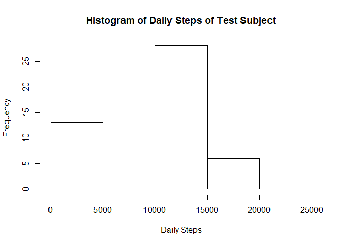
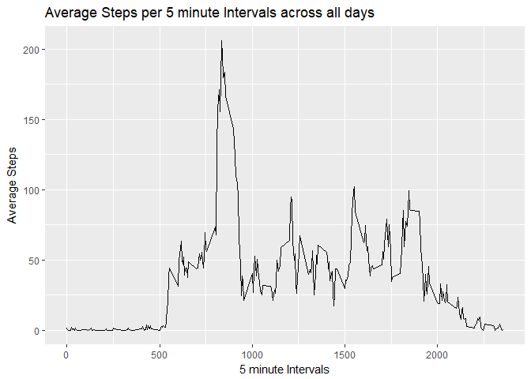
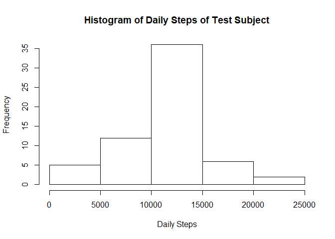
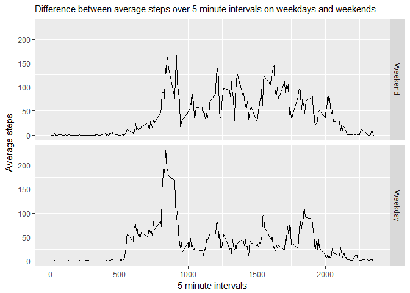

# Reproducible Research: Peer Assessment 1
kagauss  
October 26, 2017  


###Loading and preprocessing the data

Download dataset with fitness data from csv file


```r
data_url <- "https://d396qusza40orc.cloudfront.net/repdata%2Fdata%2Factivity.zip"
download.file(data_url, destfile = "activity.zip")
unzip("activity.zip")
activity_data <- read.csv("activity.csv")
```

###Work toward finding the mean of total steps per day

1. Calculate total steps per day


```r
aggregate(list(steps = activity_data$steps), list(date = activity_data$date), FUN = sum, na.rm = TRUE)
```

```
##          date steps
## 1  2012-10-01     0
## 2  2012-10-02   126
## 3  2012-10-03 11352
## 4  2012-10-04 12116
## 5  2012-10-05 13294
## 6  2012-10-06 15420
## 7  2012-10-07 11015
## 8  2012-10-08     0
## 9  2012-10-09 12811
## 10 2012-10-10  9900
## 11 2012-10-11 10304
## 12 2012-10-12 17382
## 13 2012-10-13 12426
## 14 2012-10-14 15098
## 15 2012-10-15 10139
## 16 2012-10-16 15084
## 17 2012-10-17 13452
## 18 2012-10-18 10056
## 19 2012-10-19 11829
## 20 2012-10-20 10395
## 21 2012-10-21  8821
## 22 2012-10-22 13460
## 23 2012-10-23  8918
## 24 2012-10-24  8355
## 25 2012-10-25  2492
## 26 2012-10-26  6778
## 27 2012-10-27 10119
## 28 2012-10-28 11458
## 29 2012-10-29  5018
## 30 2012-10-30  9819
## 31 2012-10-31 15414
## 32 2012-11-01     0
## 33 2012-11-02 10600
## 34 2012-11-03 10571
## 35 2012-11-04     0
## 36 2012-11-05 10439
## 37 2012-11-06  8334
## 38 2012-11-07 12883
## 39 2012-11-08  3219
## 40 2012-11-09     0
## 41 2012-11-10     0
## 42 2012-11-11 12608
## 43 2012-11-12 10765
## 44 2012-11-13  7336
## 45 2012-11-14     0
## 46 2012-11-15    41
## 47 2012-11-16  5441
## 48 2012-11-17 14339
## 49 2012-11-18 15110
## 50 2012-11-19  8841
## 51 2012-11-20  4472
## 52 2012-11-21 12787
## 53 2012-11-22 20427
## 54 2012-11-23 21194
## 55 2012-11-24 14478
## 56 2012-11-25 11834
## 57 2012-11-26 11162
## 58 2012-11-27 13646
## 59 2012-11-28 10183
## 60 2012-11-29  7047
## 61 2012-11-30     0
```

2. Plot histogram of total daily steps


```r
hist(tapply(activity_data$steps, list(activity_data$date), FUN = sum, na.rm = TRUE), xlab = "Daily Steps", main = "Histogram of Daily Steps of Test Subject")
```

<!-- -->

3. Calculate the mean and median of total steps taken per day


```r
mean(tapply(activity_data$steps, list(activity_data$date), FUN = sum, na.rm = TRUE))
```

```
## [1] 9354.23
```

```r
median(tapply(activity_data$steps, list(activity_data$date), FUN = sum, na.rm = TRUE))
```

```
## [1] 10395
```

###Average Daily Activity Pattern

1. Timeseries plot of average steps per 5 minute intervals across all recorded days


```r
library(ggplot2)
```

```
## Warning: package 'ggplot2' was built under R version 3.4.2
```

```r
interval_avg <- aggregate(list(steps =activity_data$steps), list(interval = activity_data$interval), FUN = mean, na.rm = TRUE)
ggplot(data = interval_avg, aes(x = interval, y = steps))+geom_line()+xlab("5 minute Intervals")+ylab("Average Steps")+ggtitle("Average Steps per 5 minute Intervals across all days")
```

<!-- -->

2.  Find the 5 minute interval with the maximum average steps across all recorded days

```r
interval_avg[which.max(interval_avg$steps), "interval"]
```

```
## [1] 835
```

###Imputing Missing Values

1.  Find the total number of rows in original dataset with 'NA'


```r
sum(is.na(activity_data))
```

```
## [1] 2304
```

2. Replace all rows of 'NA' with the appropriate five minute interval average

```r
imputed <- merge(activity_data, interval_avg, by = "interval")
imputed$steps.x[is.na(imputed$steps.x)] <- imputed$steps.y[is.na(imputed$steps.x)]
```

3.  Create new dataset with equal rows of original with filled in values


```r
new_data <- imputed[,c("interval", "steps.x", "date")]
colnames(new_data) <- c("interval", "steps", "date")
```


4. Create histogram of updated data


```r
hist(tapply(new_data$steps, list(new_data$date), FUN = sum), xlab = "Daily Steps", main = "Histogram of Daily Steps of Test Subject")
```

<!-- -->

Calculate the new mean and median with updated data


```r
mean(tapply(new_data$steps, list(new_data$date), FUN = sum))
```

```
## [1] 10766.19
```

```r
median(tapply(new_data$steps, list(new_data$date), FUN = sum))
```

```
## [1] 10766.19
```

The mean and median with the updated data did change by increasing both values, which is intuitive because values of 'NA' have been replaced with values > 0

###Finding Differences in Activity Patterns between Weekdays and Weekends

1.  Establish new column checking if date is weekday


```r
new_data$weekday <- !grepl(paste(c("Saturday", "Sunday"), collapse = "|"), weekdays(as.Date(new_data$date)))
```

2.  Create new data.Frame with weekday levels


```r
new_data2 <- aggregate(list(steps = new_data$steps), list(interval = new_data$interval, weekday = as.factor(new_data$weekday)), FUN = mean)
levels(new_data2$weekday) <- c("Weekend", "Weekday")
```

3.  Final time-series plot showing differences in average daily steps between weekdays and weekends


```r
ggplot(data = new_data2, aes(x = interval, y = steps))+geom_line()+facet_grid(weekday~.)+xlab("5 minute intervals")+ylab("Average steps")+ggtitle("Difference between average steps over 5 minute intervals on weekdays and weekends")+theme(plot.title = element_text(size = 11))
```

<!-- -->

